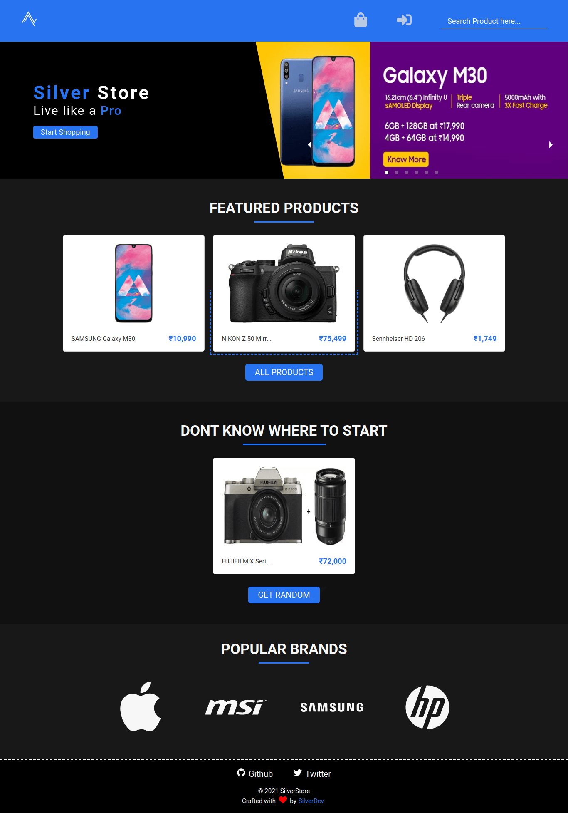

# SilverStore

This is how homepage will look like at initial render if nothing goes wrong 😅

## Preview this project here 👉 [SilverStore](https://silver-store-react.onrender.com/)

 

# Tech Stack

> Frontend

- React
- SCSS

> Backend

- Express
- Mongoose
- MongoDB
- JWT (Authentication)

 

# Features

## >>> Without Authentication

 

> Light / Dark theme toggler

Double Click on the icon (Logo) to toggle between light and dark theme <small>(It will popup one notification on initial render about this)</small>

 

> Search for product

Search for product with its keyword to naviagate straight to that product

 

> Random product

If you have lot of money and dont know what to buy then you can use this to make desicions.😅

 

> Products

- In products page you can see list of all products and you can filter those products by its category, company and its price.

- In products page you can toggle between list or grid view to see the products.

 

> Single product

In product detail page you can see expanded detail about single product like, specifications, and reviews.

 

## >>> With Authentication

 

> Add products to cart

You can add products to your cart for later purchasing 😉

 

> Add review to the product

You can add Review to the product (One review for one product)

 

> Increase or decrease product count in cart

After product added to cart you can increase or decrease it count as your need.

 

> Remove product from cart

Remove product from cart if you dont want to be purchased with your real money.😅

 

> Checkout your products

You can checkout your products in cart to get your products delivered to your home, be ready with money 😉

 

## >>> Authentication

 

> Signup

- Simple signup method with username, email and password.
- After signup if its real email you will get welcome mail.

 

> Login

Login user with password checking

 

> Forgot password

If you forgot your password then you can provide your email and get reset password link in your mail.

 

## >> Profile

 

If your are logged in then you can access your profile page, here you can

- Upload your profile picture
- Update your Username or Email
- Update your password

This profile picture will be visible in reviews you added on products.

 

## Any Suggestion make a pull request 😉.
